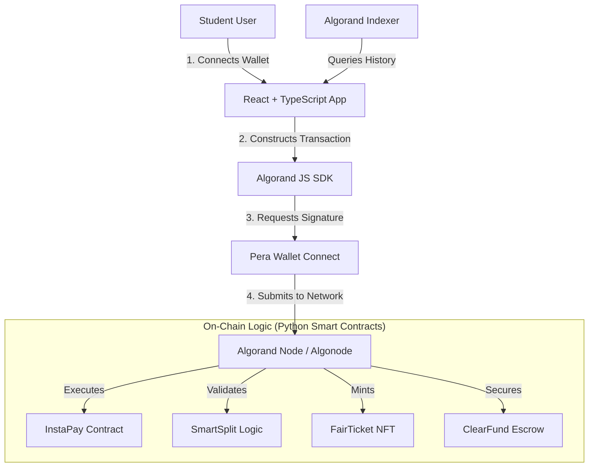

# DeckPay

**The Ultimate Blockchain Finance Platform for Indian Students**

DeckPay is an Algorand-powered financial ecosystem designed to solve the unique challenges of Indian college life—extortionate payment gateway fees, delayed settlements, ticket scalping, and opaque fundraising. Built for the **Algorand India Hackathon 2026**.

---

## Core Features

| Feature | Problem Solved | Algorand Technology Used |
|---------|----------------|--------------------------|
| **InstaPay™** | High Gateway Fees (2%+) & Delays | **Micro-transactions** (Live TestNet Payments) |
| **SmartSplit™** | Group Bill Disputes | **Atomic Transfers** (Multi-party settlement) |
| **FairTicket™** | Black Market Scalping | **NFT Tickets** (ARC-3 standards) |
| **ClearFund™** | Lack of Transparency in Donations | **Smart Contract Escrows** (Transparent tracking) |

---

## System Architecture

The following diagram illustrates the interaction between the student user, the frontend application, and the Algorand blockchain infrastructure.



---

## How to Run

### 1. Prerequisites
- **Node.js**: Install from [nodejs.org](https://nodejs.org/) (Version 18 or higher)
- **Git**: Install from [git-scm.com](https://git-scm.com/)
- **Wallet**: Install [Pera Wallet](https://perawallet.app/) on your phone and switch it to **TestNet**.

### 2. Basic Setup

```bash
# Clone the repository
git clone <your-repo-link>
cd MLSC

# Navigate to frontend
cd projects/frontend

# Install dependencies
npm install
```

### 3. Environment Configuration
The app is pre-configured for **Algonode TestNet**. Ensure your `.env` in `projects/frontend/` looks like this:
```env
VITE_ALGOD_SERVER=https://testnet-api.algonode.cloud
VITE_ALGOD_PORT=
VITE_ALGOD_TOKEN=
VITE_ALGOD_NETWORK=testnet
VITE_INDEXER_SERVER=https://testnet-idx.algonode.cloud
VITE_INDEXER_PORT=
VITE_INDEXER_TOKEN=
```

### 4. Launch the App

```bash
# Start the development server
npm run dev
```

**Open [http://localhost:5173](http://localhost:5173)** in your browser.

---

## Testing on TestNet

1.  **Get Test ALGO**: Go to the [Algorand TestNet Dispenser](https://bank.testnet.algorand.network/) and paste your Pera Wallet address.
2.  **Connect**: Open DeckPay, click **"Connect Wallet"**, and scan the QR code with your Pera Wallet.
3.  **Transact**: 
    - Go to **InstaPay** to send a small amount.
    - Go to **FairTicket** to mint an event ticket.
    - See your balance update instantly on the **Dashboard**.

---

## Repository Map

```bash
│   ├── contracts/   # Pure Python Smart Contracts (Smart-Signatures)
│   └── frontend/    # React-Vite Frontend (The Core App)
│       └── src/
│           ├── components/ # Layout & Navigation
│           ├── pages/      # InstaPay, SmartSplit, etc.
│           └── index.css   # Custom DeckPay Styling
```

---
